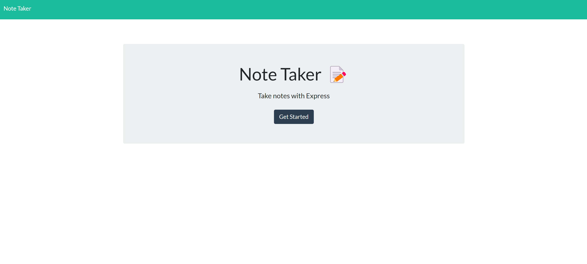
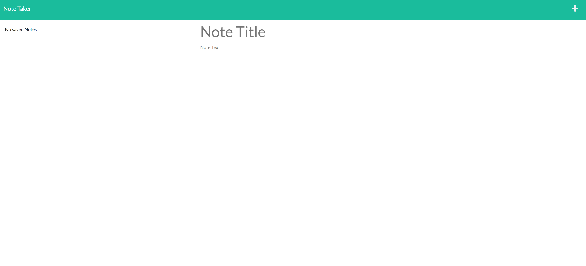

    
# Express Note Taker

## Description

This is a simple note-taking application, powered by Express.js

## Table of Contents

[title](#title)
[description](#description)
[installation](#installation)
[licenses](#licenses)
[usage](#usage)
[contributing](#contributing)
[tests](#tests)
[email](#email)
[github](#github)

## Installation

No installation required; simply follow the link provided below.

## Usage 

To begin, hit the "Get Started" button, after which you will be directed to the application's main page. Here, you must enter both a title and description of your task. Once complete, hit the save button in the upper right-hand corner (shown below) to save your task to the task pane on the left. You can delete any task by hitting its trash icon.

## Contributing

Feel free to fork or leave suggestions in the Slack channel.

## Deployed Application

You can find the deployed application in the link below:

https://note-taker-rrich-kray.herokuapp.com/

## Questions

Feel free to shoot me any questions at the email below:

rrich.kray@gmail.com

find my GitHub profile by following the link below:

https://github.com/rrich-kray/